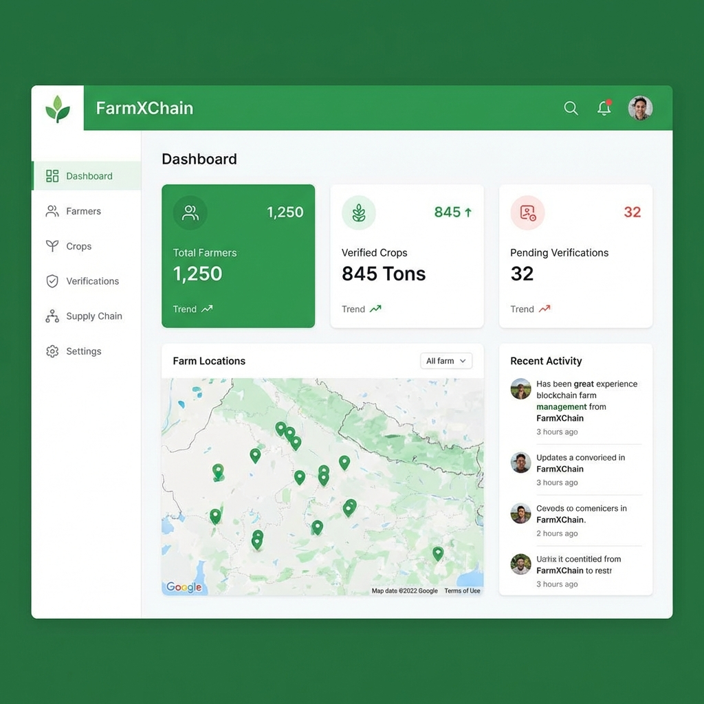

# FarmXChain - Blockchain-Based Farm Management System





FarmXChain is a comprehensive blockchain-based farm management system that connects farmers, distributors, retailers, and consumers in a transparent and secure agricultural supply chain. The system leverages blockchain technology to ensure crop traceability and verification throughout the supply chain.

## 🏗️ Architecture

### Backend
- **Framework**: Spring Boot 3.x
- **Language**: Java 17
- **Database**: MySQL 8.0
- **Authentication**: JWT (JSON Web Tokens)
- **API Documentation**: OpenAPI/Swagger
- **Security**: Spring Security with JWT authentication

### Frontend
- **Framework**: React 18.x
- **Styling**: Tailwind CSS
- **Build Tool**: Vite
- **State Management**: React Hooks

### Blockchain Integration
- Custom blockchain implementation for crop verification
- Hash generation for immutable records
- Decentralized verification system

## 🚀 Quick Start

### Prerequisites
- Java 17 or higher
- Node.js 16.x or higher
- MySQL 8.0
- Maven 3.x

### Backend Setup

1. **Clone the repository**
   ```bash
   git clone <repository-url>
   cd FarmXChain
   ```

2. **Database Setup**
   - Create MySQL database: `fdb`
   - Update database credentials in `src/main/resources/application.properties`
   - Run the database setup script: `src/main/resources/database-setup.sql`

3. **Configure Application**
   - Update JWT secret in `application.properties`
   - Configure server port (default: 8080)
   - Set context path: `/api/v1`

4. **Run the Backend**
   ```bash
   mvn clean install
   mvn spring-boot:run
   ```

### Frontend Setup

1. **Navigate to frontend directory**
   ```bash
   cd frontend
   ```

2. **Install dependencies**
   ```bash
   npm install
   ```

3. **Configure API endpoint**
   - Update API base URL in configuration files

4. **Run the Frontend**
   ```bash
   npm run dev
   ```

## 🔐 Authentication

FarmXChain uses JWT-based authentication. All API requests (except registration and login) require a valid JWT token in the Authorization header.

### Authentication Flow
1. User registers with email, password, and role
2. Admin verifies the user account
3. User logs in to receive JWT token
4. Token is included in subsequent API requests

## 👥 User Roles & Permissions

### 1. Admin
- User management (verify, reject, suspend, activate users)
- Farmer verification and management
- System statistics and monitoring
- Full access to all endpoints

### 2. Farmer
- Create and manage farmer profile
- Add and manage crops
- View crop blockchain verification status
- Access farmer-specific endpoints

### 3. Distributor
- View verified crops and farmers
- Access distribution network information

### 4. Retailer
- Access verified supply chain data
- View crop traceability information

### 5. Consumer
- View verified products
- Access blockchain-verified crop information

## 📡 API Documentation

Base URL: `http://localhost:8080/api/v1`

### Authentication Endpoints

#### Register User
```http
POST /auth/register
Content-Type: application/json

{
  "email": "user@example.com",
  "password": "password123",
  "firstName": "John",
  "lastName": "Doe",
  "role": "FARMER"
}
```
**Response**: UserDTO with registration status

#### Login
```http
POST /auth/login
Content-Type: application/json

{
  "email": "user@example.com",
  "password": "password123"
}
```
**Response**: LoginResponse with JWT token

#### Validate Token
```http
GET /auth/validate
Authorization: Bearer <jwt-token>
```
**Response**: Token validation status

### User Management Endpoints

#### Get Current User Profile
```http
GET /users/profile
Authorization: Bearer <jwt-token>
```
**Response**: UserDTO

#### Get User by ID
```http
GET /users/{userId}
Authorization: Bearer <jwt-token>
```
**Response**: UserDTO

#### Get User by Email
```http
GET /users/email/{email}
Authorization: Bearer <jwt-token>
```
**Response**: UserDTO

#### Get Users by Role
```http
GET /users/role/{role}
Authorization: Bearer <jwt-token>
```
**Response**: List<UserDTO>

#### Get All Users
```http
GET /users
Authorization: Bearer <jwt-token>
```
**Response**: List<UserDTO>

#### Get All Farmers
```http
GET /users/farmers/all
Authorization: Bearer <jwt-token>
```
**Response**: List<UserDTO>

#### Get All Distributors
```http
GET /users/distributors/all
Authorization: Bearer <jwt-token>
```
**Response**: List<UserDTO>

#### Get All Retailers
```http
GET /users/retailers/all
Authorization: Bearer <jwt-token>
```
**Response**: List<UserDTO>

#### Get All Consumers
```http
GET /users/consumers/all
Authorization: Bearer <jwt-token>
```
**Response**: List<UserDTO>

#### Delete User
```http
DELETE /users/{userId}
Authorization: Bearer <jwt-token>
```
**Response**: Success message

### Farmer Management Endpoints

#### Create Farmer Profile
```http
POST /farmers/profile
Authorization: Bearer <jwt-token>
Content-Type: application/json

{
  "farmName": "Green Valley Farm",
  "location": "California, USA",
  "farmSize": 100.5,
  "specialization": "Organic Vegetables",
  "experience": 15
}
```
**Response**: FarmerDTO

#### Update Farmer Profile
```http
PUT /farmers/profile
Authorization: Bearer <jwt-token>
Content-Type: application/json

{
  "farmName": "Updated Farm Name",
  "location": "Updated Location",
  "farmSize": 150.0,
  "specialization": "Organic Fruits",
  "experience": 20
}
```
**Response**: FarmerDTO

#### Get Farmer Profile
```http
GET /farmers/profile
Authorization: Bearer <jwt-token>
```
**Response**: FarmerDTO

#### Get Farmer by ID
```http
GET /farmers/{farmerId}
Authorization: Bearer <jwt-token>
```
**Response**: FarmerDTO

#### Get Farmers by Crop Type
```http
GET /farmers/crop/{cropType}
Authorization: Bearer <jwt-token>
```
**Response**: List<FarmerDTO>

#### Get All Farmers
```http
GET /farmers/all
Authorization: Bearer <jwt-token>
```
**Response**: List<FarmerDTO>

#### Delete Farmer Profile
```http
DELETE /farmers/{farmerId}
Authorization: Bearer <jwt-token>
```
**Response**: Success message

### Crop Management Endpoints

#### Add Crop
```http
POST /crops/add
Authorization: Bearer <jwt-token>
Content-Type: application/json

{
  "cropType": "Tomato",
  "quantity": 500.0,
  "unit": "kg",
  "plantingDate": "2024-01-15",
  "expectedHarvestDate": "2024-04-15",
  "description": "Organic tomatoes"
}
```
**Response**: CropDTO (automatically registered on blockchain)

#### Get My Crops
```http
GET /crops/my-crops
Authorization: Bearer <jwt-token>
```
**Response**: List<CropDTO>

#### Get Crop by ID
```http
GET /crops/{cropId}
Authorization: Bearer <jwt-token>
```
**Response**: CropDTO

#### Get All Crops
```http
GET /crops/all
Authorization: Bearer <jwt-token>
```
**Response**: List<CropDTO>

#### Get Blockchain-Verified Crops
```http
GET /crops/blockchain-records
Authorization: Bearer <jwt-token>
```
**Response**: List<CropDTO>

#### Verify Blockchain Record
```http
GET /crops/{cropId}/verify-blockchain
Authorization: Bearer <jwt-token>
```
**Response**: Boolean verification status

### Admin Management Endpoints

#### Get All Users (Admin)
```http
GET /admin/users
Authorization: Bearer <admin-jwt-token>
```
**Response**: List<UserDTO>

#### Get Pending Users
```http
GET /admin/users/pending
Authorization: Bearer <admin-jwt-token>
```
**Response**: List<UserDTO>

#### Verify User
```http
POST /admin/users/{userId}/verify
Authorization: Bearer <admin-jwt-token>
```
**Response**: UserDTO with updated status

#### Reject User
```http
POST /admin/users/{userId}/reject
Authorization: Bearer <admin-jwt-token>
```
**Response**: UserDTO with suspended status

#### Suspend User
```http
POST /admin/users/{userId}/suspend
Authorization: Bearer <admin-jwt-token>
```
**Response**: UserDTO with suspended status

#### Activate User
```http
POST /admin/users/{userId}/activate
Authorization: Bearer <admin-jwt-token>
```
**Response**: UserDTO with active status

#### Get Pending Farmers
```http
GET /admin/farmers/pending
Authorization: Bearer <admin-jwt-token>
```
**Response**: List<FarmerDTO>

#### Get Farmers by Status
```http
GET /admin/farmers/status/{status}
Authorization: Bearer <admin-jwt-token>
```
**Status**: PENDING, VERIFIED, REJECTED
**Response**: List<FarmerDTO>

#### Verify Farmer
```http
POST /admin/farmers/{farmerId}/verify
Authorization: Bearer <admin-jwt-token>
```
**Response**: FarmerDTO with verified status

#### Reject Farmer
```http
POST /admin/farmers/{farmerId}/reject
Authorization: Bearer <admin-jwt-token>
Content-Type: application/json

{
  "rejectionReason": "Documentation incomplete"
}
```
**Response**: FarmerDTO with rejected status

#### Get Farmer Details
```http
GET /admin/farmers/{farmerId}
Authorization: Bearer <admin-jwt-token>
```
**Response**: FarmerDTO

#### Delete Farmer
```http
DELETE /admin/farmers/{farmerId}
Authorization: Bearer <admin-jwt-token>
```
**Response**: Success message

#### Get Total Farmers Count
```http
GET /admin/stats/farmers
Authorization: Bearer <admin-jwt-token>
```
**Response**: Integer count

#### Get Total Users Count
```http
GET /admin/stats/users
Authorization: Bearer <admin-jwt-token>
```
**Response**: Integer count

## 🔄 Workflow

### User Registration & Verification Flow
1. **Registration**: User registers with basic information and role
2. **Admin Review**: Admin reviews and verifies user account
3. **Activation**: User account is activated and can login
4. **Role-Specific Actions**: User performs actions based on their role

### Farmer Workflow
1. **Profile Creation**: Farmer creates detailed profile
2. **Admin Verification**: Admin verifies farmer credentials
3. **Crop Management**: Farmer adds crops (automatically blockchain-registered)
4. **Verification**: System verifies blockchain records for transparency

### Supply Chain Flow
1. **Crop Production**: Farmers add verified crops to blockchain
2. **Distribution**: Distributors access verified crop information
3. **Retail**: Retailers display blockchain-verified products
4. **Consumption**: Consumers verify product authenticity

## 🛡️ Security Features

- **JWT Authentication**: Secure token-based authentication
- **Role-Based Access Control**: Different permissions for different user roles
- **Blockchain Verification**: Immutable crop records
- **Input Validation**: Comprehensive request validation
- **CORS Configuration**: Cross-origin resource sharing setup

## 📊 Database Schema

### Core Tables
- **users**: User accounts with roles and status
- **farmers**: Detailed farmer profiles
- **crops**: Crop information with blockchain hashes
- **farmer_verification**: Farmer verification records

### Key Relationships
- Users can have one farmer profile (one-to-one)
- Farmers can have multiple crops (one-to-many)
- All records include timestamps and status tracking

## 🔧 Configuration

### Application Properties
```properties
# Server
server.port=8080
server.servlet.context-path=/api/v1

# Database
spring.datasource.url=jdbc:mysql://localhost:3306/fdb
spring.datasource.username=root
spring.datasource.password=your_password

# JWT
jwt.secret=your-secret-key
jwt.expiration=86400000

# File Upload
file.upload-dir=uploads/
file.max-size=10485760
```

## 🧪 Testing

### Backend Testing
```bash
mvn test
```

### Frontend Testing
```bash
cd frontend
npm test
```

## 📝 API Response Format

All API responses follow a consistent format:

```json
{
  "success": true,
  "message": "Operation completed successfully",
  "data": { ... },
  "statusCode": 200
}
```

### Error Response Format
```json
{
  "success": false,
  "message": "Error description",
  "statusCode": 400
}
```

## 🤝 Contributing

1. Fork the repository
2. Create a feature branch
3. Make your changes
4. Add tests if applicable
5. Submit a pull request

## 📄 License

This project is licensed under the MIT License - see the LICENSE file for details.

## 📞 Support

For support and questions, please contact the development team or create an issue in the repository.
